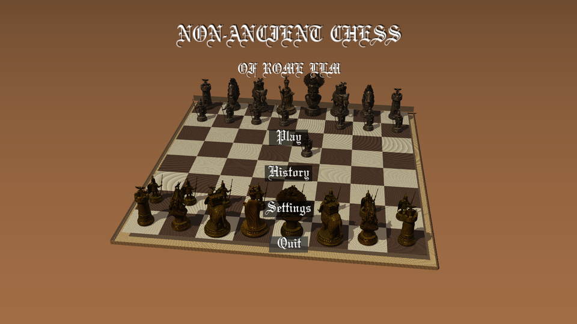
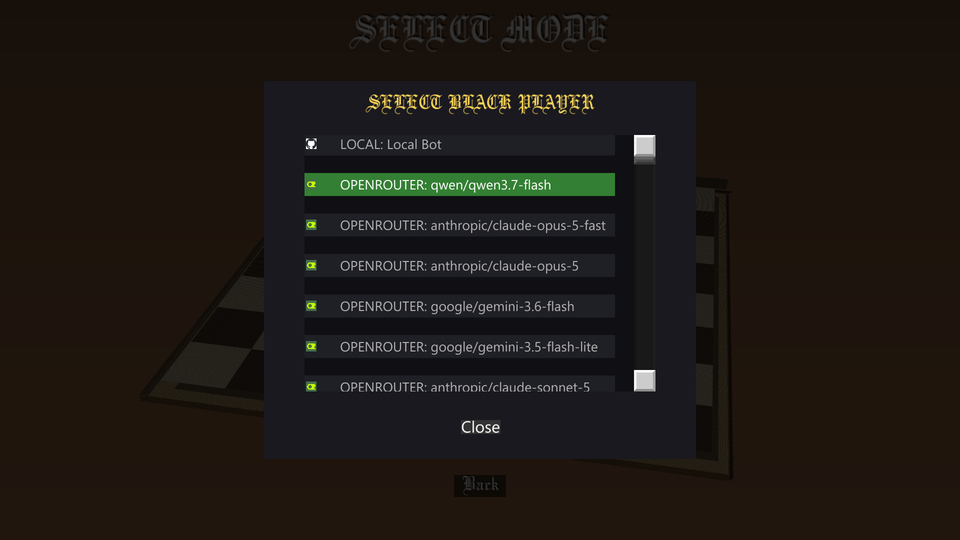
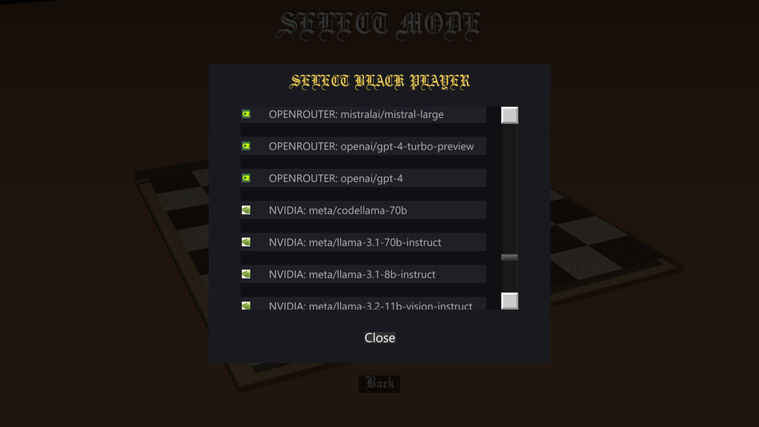
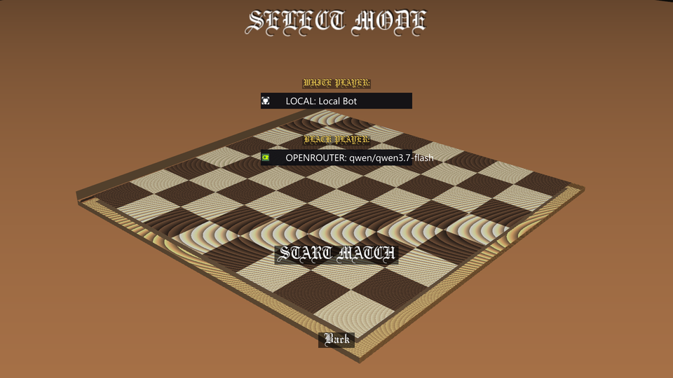
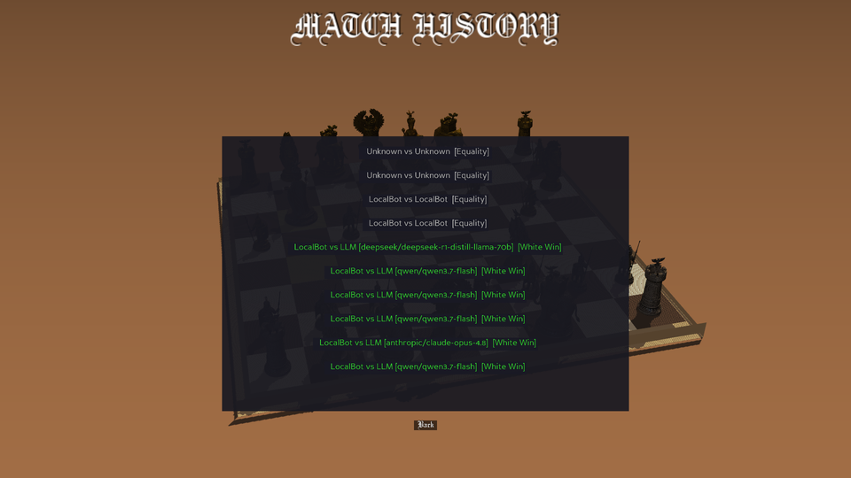
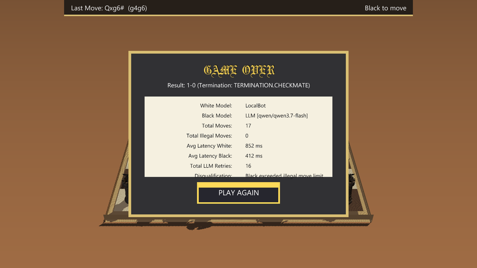

# ♟️ Non-Ancient Chess of Rome LLM


**A full-stack 3D chess arena where 10 different LLM providers battle each other — or face a hand-rolled negamax engine — in a cinematic Panda3D world with real-time animations, fog, shadows, smooth camera transitions, per-match analytics, history replay, and a custom gold-trimmed DirectGUI interface.**

---

## 🎬 Visual Showcase

Here is a glimpse into the fully cinematic UI, completely built using Panda3D DirectGUI.

### 🏠 Main Menu & Atmosphere


### 🤖 10+ LLM Provider Selection
Connect any major API! Simply paste the key, and the system auto-detects it, displaying their real logos.
<p align="center">
  
  
  
</p>

### ⚙️ Settings & Configuration (Animated)


### 📜 Match History & Replay System (Animated)
View your past games, analyzed move-by-move.
<p align="center">
  
</p>
<p align="center">
  
</p>

### 🏁 Game Over Analytics


---

##  Architecture Overview

```
main.py                →  game_3d.py  (Panda3D ShowBase)
├── src/
│   ├── chess_renderer.py    →  3D board + GLB pieces + lighting + shadows + animations
│   ├── background_show.py   →  Cinematic orbital camera for menu screens
│   ├── api_manager.py       →  10 LLM provider integrations with caching
│   ├── config_manager.py    →  Persistent JSON settings with deep-merge
│   ├── stats_tracker.py     →  Per-move analytics + match history JSON
│   └── screens/
│       ├── base_screen.py        →  Custom dark-theme UI toolkit (buttons, panels, labels)
│       ├── main_menu.py         →  Start screen with orbit background
│       ├── mode_select_screen.py →  Provider select + logo icons
│       ├── settings_screen.py  →  Full AIPConfiguration + scroll + fullscreen
│       ├── game_screen.py      →  Live loop, HUD topbar, think animation, game-over panel
│       ├── history_screen.py   →  Last 10 matches with color-coded results
│       └── replay_screen.py    →  Timeline slider + auto-play per move
├── bot_llm.py              →  LLM-heavy: retry logic, illegal-move detection
├── bot_local.py            →  Negamax + quiescence + opening book + PST evaluator
└── match_history.json      →  Persistent serialized game records
```

---

##  Key Technical Decisions

### ♟️ 10 LLM Providers — Multi-LLM Orchestration

`src/api_manager.py` integrates **10 providers** through a unified `chat_completion` entry point:

| Provider | Endpoint Pattern | Token Prefix Auto-Detect |
|---|---|---|
| OpenAI | `/v1/chat/completions` | `sk-` |
| Anthropic | `/v1/messages` (custom Messages API) | `sk-ant-` |
| Google Gemini | `/v1beta/openai/chat/completions` | `AIza` |
| DeepSeek | `/chat/completions` | `sk-d-` |
| Groq | `/openai/v1/chat/completions` | `gsk_` |
| Nvidia NIM | `/v1/chat/completions` | `nvapi-` |
| Together | `/v1/chat/completions` | bare token |
| Mistral | `/v1/chat/completions` | bare token |
| OpenRouter | `/api/v1/chat/completions` | `sk-or-` |
| Ollama (local) | `/v1/chat/completions` on `localhost:11434` | — |

**Key Features:**
- Provider auto-detection from API key prefix (user just pastes any key)
- Model list caching with discount API signature (sha256 hash)
- Every provider get its own default model catalog

---

### 🛡️ Bus Error Handling — TheLLM Bot (`bot_llm.py`)

```
LLM.get_move(board)
├── build: system prompt + FEN + legal UCI moves
├── for attempt 1..3:
│      ├── chat_completion(provider, model, messages, t=0.1)
│      ├── parse returned uci, validate via python-chess    
│      │     ├── legalsa → return move + token/time stats
│      │     └── illegal → flag in stats → continue ( retry + append error prompt)
│      └──if API error → continue
└── animation dispatched: random legal move (fallback flag = True)
```

This is logged every move: `tokens_in/out`, `retries`, `delay_ms`, `illegal_attempts` and ported to the game-end summary. If an LLM exhausts its 3 tries, a **disqualification flag** shows in the game-over panel.

---

### 🧠 Localing Engine (`bot_local.py`)

**Negamax + Alpha-Beta + Quiescence** with advanced features:

| Component | Detail |
|---|---|
| **Search** | Negamax with alpha-beta pruning, depth 3 |
| **Quiescence** | Ccapture-only horizon extension to avoid "hanging" blunders |
| **Move Ordering** | MVV-LVA  + killer history heuristic |
| **Evaluation** | Piece-square tables (6 tables; middle-game vs endgame king tables) |
| **Opening Book** | goden 4 main openings (e4/ d4 → responses) to generate human-like open |
| **King Safety** | Castled-position bonus (+70 points O-O, +60 O-O-O) |
| **Endgame Detection** | No queens + trajectory < 2600 → switches to KK endgame table |

---

### 🎨 Custom DirectGUI System

`src/screens/base_screen.py` provides a unified UI toolkit used on every screen:

| Element | Description |
|---|---|
| `OldeEnglish.ttf` | Gothic bold for headlines |
| `SegoeUI.ttf` | Clean readability for body/labels |
| **create_title()** | Gold-shadowed OldeEnglish heading |
| **create_button()** | Auto-sized colored button with 4-state framecolor (normal, hover, clicked, disabled) |
| **create_label()** | Sub-title with auto-width dark background |
| **color palette** | `TEXT_WHITE` / `TEXT_GOLD` / `TEXT_DIM` / `PANEL_BLACK` |

All screens (main menu, mode select, game HUD, game-over panel, settings, history, replay) inherit from `BaseScreen`.

---

### 🏎 3D Scene Engine (`chess_renderer.py`)

- **Realboard**: 8x8 unit squares, light=cream `(0.96,0.89,0.74)`, dark=dark walnut `(0.34,0.22,0.18)`, OSBock wood walls
- **Pieces**: Turkish GLB models, Y-up to Z-up conversion, auto-scaling to target heights per type (pawn=0.85,…,king=1.55)
- **Metallic rendering**: Strips baked PBR textures; applies gta performance: 
| Side | Diffuse | Specular | Shininess |
|---|---|---|---|
| White (Silver) | `(0.85, 0.85, 0.9)` | `(1.0, 1.0, 1.0)` | 90 |
|  Black (Gold) | `(0.95, 0.75, 0.15)` | `(1.0, 0.85, 0.)` | 80 |
- **shadows**: Directional light shadow caster (2048x2048 map)
- **fog**: Conceal table borders with exponential fog density 0.02
- **Antialiasing**: 4x MSAA in combination with full-screen or hd window
- **Animations**: 3-point bFor trip; capturing piece pops into the air

---

### 🎮 Imm GameLoop (`game_screen.py`)

- **Threaded**: The outer `while` loop runs in a second thread; the main thread updates the HUD and handles animation timing
- **HUD Topbar**: Gold border + brown inner panel always visible
  - On left: Last Move (SAN + UCI)
  - In heart: "Thinking…" animated dots (3 Hz for LLM players)
  - On right: White or black to move indication
- **Camera rotation**: `cam_rig.setH(0 or 180)` rotates board to current player's perspective smoothly (1.5 s ease-in-out)
- **Game Over**: Gold-framed dark modal with cream internal panel displaying 7 statistics:
  1. Result + termination
  2. White / Black models
  3. Total moves
  4. Total illegal moves
  5. Average latency white (ms)
  6. Average latency black (ms)
  7. Total LLM retries
  + Disqualification field (if any)

---

### 📊 Perplexity Tracking (`stats_tracker.py`)

Every move records: `move_uci, move_san, player_name, latency_ms, tokens_in, tokens_out, retries, illegal_attempts, api_error, fallback`

On game end:
- aggregating white/black average latency
- token totals
- illegal move counts
- match result & mate/result terminations

All saved to `match_history.json` for persistence across sessions.

---

### 🔁 Replay System

- **`Match History Screen`**: Last 10 matches, color-coded (green = White win, red = Black win, gray = Draw)
- **`Replay Screen`**: Full game replay
  - `DirectSlider` to jump through every move
  - Play/Pause auto-advance every 0.6 seconds
  - `chess.Board` locally rebuilt for performance from stored `move_uci` array
  - Current move details shown ( ply, color, SAN, latency)

---

## 🛠 How to Run

### Option 1: One-Click Launcher (Recommended)
Simply double-click **`PLAY.bat`** on Windows. 
It will automatically detect your Python installation (`python` or `py`), check for missing requirements, install them automatically via pip, and launch the 3D game.

### Option 2: Manual Terminal
```bash
# 1 Install dependencies
pip install panda3d chess requests

# 2 launch it ( 3D mode default)
python main.py

# If you prefer the text-based console 2D mode:
python game_manager.py
```

**API Keys (for LLM play)**
Paste your key in **Settings** screen → the app auto-detects the provider from its prefix. Or use explicit format: `provider:sk-xx`.

Supported detection patterns:
| If key starts with: | Assigts to |
|---|---|
| `sk-` | OpenA I |
| `sk-ant-` | Anthropic |
| `AIza` | Google |
| `gsk_` | Groq |
| `nvapi-` | Nwidia |
| `sk-or-` | OpenRouter |
| Other | Works with Mistral, Together once you assign with `provider:` prefix |

---

## 📁 File Structure

```
chess-project/
├── main.py                        # Entry (launch 3D)
├── game_manager.py                # Console 2D fallback
├── bot_llm.py                     # LLM move generation + retry
├── bot_local.py                   # Negamax engine + quiescence
│
├── chess_models/                  # 6 GLB (glTF) models (Şah, Vezir, Kale…)
├── Assets/
│   ├── logos/                     # Provider logos (anthropic, openai, lidama…)
│   └── ui/                        # Button textures
│
├── src/
│   ├── api_manager.py           # 10 A.IP client + cache
│   ├── chess_renderer.py       # Whole 3D scene (board, pieces, lights, shadows, animation)
│   ├── background_show.py      # Orbiting camera (menu)
│   ├── config_manager.py       # settings.json I/O
│   ├── stats_tracker.py        # per-match analytics / history
│   └── screens/
│       ├── base_screen.py         # Reusable UI styling model
│       ├── main_menu.py
│       ├── mode_select_screen.py
│       ├── settings_screen.py
│       ├── game_screen.py
│       ├── history_screen.py
│       └── replay_screen.py
│
├── match_history.json             # auto-generates
├── settings.json
├── model_cache.json               # provider model cache
│
├── OldeEnglish.ttf                # Title font
├── SegoeUI.ttf                    # Body font
│
└── screen_shots/                  # Showcase images & mp4
    ├── Main_Menu.png
    ├── LLM_Select_Screen.png
    ├── LLM_Select_Screen1.png
    ├── LLM_Select_Screen3.png
    ├── Game_Over_Screen.png
    ├── Match_History_Screen.png
    ├── Match_History_Screen.gif
    └── Settings_Screen.gif
```

---

## 💡 Why This Project Stands Out

- ✅ **10 LLM providers mashed into one platform** — not a wrapper, but an interactive chess arena
- ✅ **Full-stack 3D game** — not a dataset reproducibility test; from graphics, fonts, shadow caster, to scene graph
- ✅ **Graced LLC error handling**: disqualified detection, illegal cheat, retries, fallback
- ✅ **Theur real UX**: smooth camera rotation, orbit background, mode select modal, game-over analytics
- ✅ **Production-ready persistence**: match_history.json, model cache, deep-merge config
- ✅ **Portable 2D console mode** — `python game_manager.py`
- ✅ **All code, no bloat**: every screen is a Python class, not an auto-generated template
- run back into pre-marked 3D round

---

## 📝 License

MIT — Free to use, modify, and distribute.

---
**[✨ Star the repository if you enjoyed watching AI battle it out! ✨]**
